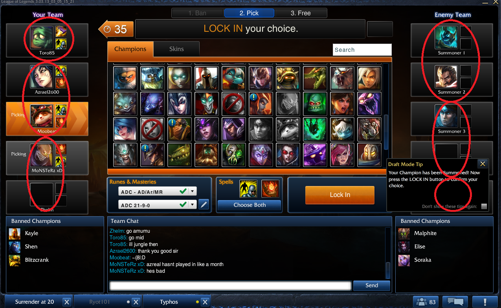
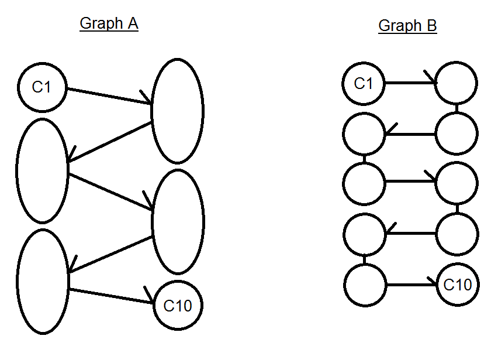

# League of Legends Champion Select Model

## Problem Statement
League of Legends is an online multiplayer game in which two teams of 5 players do battle. Each player must select a champion (a character) to play before the battle begins. Since these champion picks must be unique, this leads to a possible 2*(147 choose 10) possible team vs team combinations.  Some of these variations lead to inherent advantages for one team over the other, giving that team a better chance at winning.

Our goal is to create a tool that will predict which champions a team should select that maximize the probability of arriving at an advantageous combination of champions.

The above image shows a picture of the champion selection process. Each team takes turns selecting champions according to the following order:  A, B, B, A, A, B, B, A, A, B. 

The above figure shows this champion select in the form of a directed acyclic graph in Graph A.  That model is further simplified in Graph B. 

## Model

Our tool will attempt to provide the mle estimate of the i-th champion pick.

Picki = argmax p( win | picki )                                       (1)

The probability can be expanded as a marginalization across pick i+1:

p( win | picki ) = sum p(win , picki+1 | picki )                                   (2)

Thus, given the state of the draft at the k-th pick, we aim to learn the conditional probability through marginalization.
Since we know the dependencies of the champion picks given the Graph B, we can nest these marginalizations by starting from the pick deepest along each graph.

Thus, we have formula 3:

sum sum ... sum p(win , picki+1, picki+2, ... , picki+n | picki )                        (3)

where n is the number of remaining picks in the draft. For example, for pick 3, n = 7.

## Algorithm:

Using the above formulae formula, we coded a recursive algorithm that performs these marginalizations.

	Function get_probability(pick,champion_space):
		If pick 10, return list of all N possible probabilities
		Else:
			Initialize probability_vector to zeros.
			For every possible champion i:
				Query new champion space containing champion i at pick n+1
				Probability_vector[i] = marginalize(get_probability(pick n + 1, new_space))
			Return probability_vector

And the final result is the probability vector sorted in descending order with corresponding champion label.

	Function get_wins(pick,champion_space):
		If pick 10, return list of number of wins and losses per draft
		Else:
			Initialize win_vector  to zeros.
			For every possible champion i:
				Query new champion space containing champion i at pick n+1
				win_vector[i] = sum(get_wins(pick n + 1, new_space))
			Return win_vector

This algorithm is a pure voting algorithm that extracts the number of wins and losses and then normalizes this as a probability after completion. This allows us to have information about how many winning and losing variations result from a pick.

## Assumptions

Our model makes two assumptions.

The first assumption is that probability of winning is team invariant. That is, a potential winning team for team A is also a potential winning team for Team B if the data is flipped.

The second assumption is that the order in which the champions are picked is invariant under any permutation, meaning that there are factorial(5)^2 ways to get to any given combination.
 
## Testing Metrics
It’s difficult to evaluate this model far into each draft as there is simply not enough data to hold out.
We recommend trying with a larger dataset or using some kind of ALS approach to calculate a full probability matrix.
Note that for Picks 1 and 2 runtime is extremely long due to the amount of calculations required.